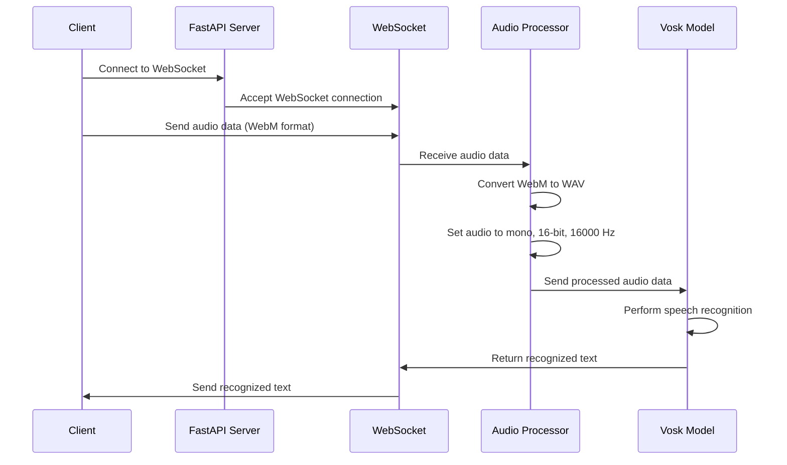

# Real-Time Speech Recognition Server Using Vosk and FastAPI

This project is a server application designed for real-time speech recognition using the Vosk model. The application leverages FastAPI to create WebSockets, enabling the handling of audio streams sent by clients.

## Key Features:

- **Real-Time Processing:** Handles audio streams in real-time via WebSockets.
- **Speech Recognition:** Utilizes the Vosk model to convert audio into text.
- **Format Support:** Converts audio files from WebM to WAV for processing.
- **Lightweight and Performant:** Uses FastAPI and Uvicorn to ensure high performance and scalability.

## Technologies:

- **FastAPI:** For creating WebSockets and handling HTTP requests.
- **Vosk:** For speech recognition.
- **Pydub:** For processing and converting audio files.
- **Uvicorn:** As the ASGI server to run the application.

